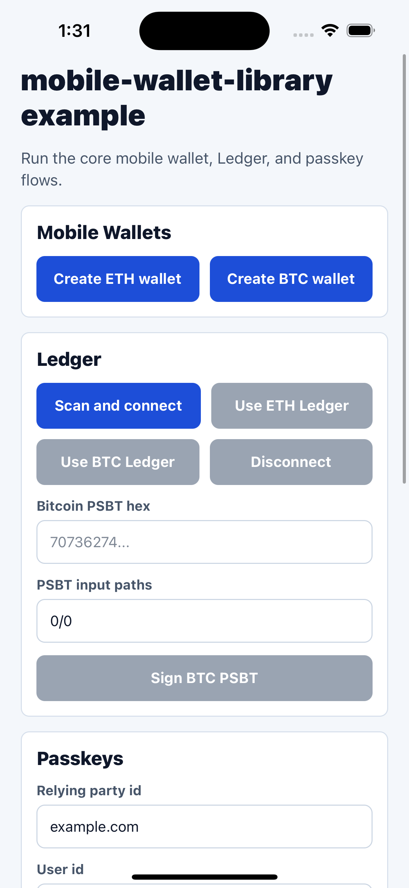

# mobile-wallet-library

[](https://www.npmjs.com/package/mobile-wallet-library)
[](LICENSE)
[](https://www.typescriptlang.org/)
[](https://reactnative.dev/)
[](https://docs.expo.dev/develop/development-builds/introduction/)
[](#compatibility)

React Native helpers for mobile wallets that use BTC and ETH mainnet.

## Overview

The library focuses on three separate flows:

- Mobile wallets: create or restore a wallet from a mnemonic and sign BTC/ETH actions.
- Passkey PRF keys: register or retrieve a passkey-derived key. Your app decides how to use it.
- Ledger devices: connect to a physical Ledger and request signatures from it.

This package does not store mnemonics, encrypt wallet data, derive Bitcoin
receiving addresses, broadcast transactions, or manage backend passkey
registration for you. Your app owns storage, encryption format, network
requests, and user recovery flows.

## Compatibility

- Expo development builds are the only tested runtime today.
- Expo Go is not supported because wallet crypto, passkeys, and Ledger Bluetooth
  flows depend on custom native code.
- The package is mainnet-only for now.
- Passkey PRF support requires native passkey support plus a PRF-capable
  platform: iOS 18 or newer, or Android 14 or newer.
- Passkey flows require an associated domain configured for your app.
- Passkey and Ledger flows should be tested on physical devices. Simulator
  support is not expected for those flows.
- Ledger support requires Bluetooth access, a physical Ledger device, and the
  target Ledger app installed on the device.

## Installation

This package uses React Native native modules. After installing or changing
native dependencies, rebuild the iOS and Android apps.

```sh
npm install mobile-wallet-library
```

### Expo Native Setup

Install and configure the native dependencies required by the flows you use:

- [`react-native-quick-crypto`](https://github.com/margelo/react-native-quick-crypto#installation): required for wallet crypto and nonce generation. Follow its Expo setup and call `install()` as early as possible in your app entry file.
- [`react-native-passkey`](https://github.com/f-23/react-native-passkey#installation): required for passkey PRF keys. Follow its native installation and iOS/Android domain association setup.
- [`react-native-ble-plx`](https://github.com/dotintent/react-native-ble-plx#configuration--installation): required for Ledger Bluetooth connections. Follow its Expo plugin and platform permission setup.

Then create a native build:

```sh
npx expo prebuild
npx expo run:ios
npx expo run:android
```

If you already have native projects checked in, rebuild them after installing or
changing these dependencies. For iOS, run CocoaPods from the generated `ios`
folder before building:

```sh
cd ios && pod install
```

## Example App

The repo includes an Expo development-build example that exercises the main
flows: BTC/ETH mobile wallet creation, BTC/ETH Ledger usage, and passkey
registration/retrieval.



Run it from the `example` workspace after installing dependencies and rebuilding
the native app:

```sh
pnpm --filter mobile-wallet-library-example prebuild
pnpm --filter mobile-wallet-library-example ios
pnpm --filter mobile-wallet-library-example android
```

Use a development build, not Expo Go. Passkey and Ledger flows require native
modules and should be tested on physical devices with the required associated
domain, Bluetooth permissions, and Ledger app installed.

## Quick Start

### Create an Ethereum Wallet

```ts
import { createMobileWallet } from "mobile-wallet-library";

const { wallet, mnemonic, address } = await createMobileWallet({
  chain: "ethereum",
});

// Show the mnemonic to the user so they can back it up.
// Store only what your app needs for its own encrypted wallet flow.
console.log({ mnemonic, address });

const messageSignature = await wallet.signMessage({
  message: "Sign in to my app",
});

const signedTransaction = await wallet.signTransaction({
  transaction: {
    to: "0x0000000000000000000000000000000000000000",
    value: 1n,
    nonce: 0,
    gasLimit: 21000n,
    gasPrice: 1n,
    chainId: 1,
  },
});

console.log({ messageSignature, signedTransaction });
```

### Create a Bitcoin Wallet

```ts
import { createMobileWallet } from "mobile-wallet-library";

const { wallet, mnemonic } = await createMobileWallet({
  chain: "bitcoin",
});

console.log({ mnemonic });

const accountXpub = await wallet.getExtendedPublicKey({
  derivationPath: "m/49'/0'/0'",
});

const messageSignature = await wallet.signMessage({
  message: "Sign in to my app",
  derivationPath: "m/49'/0'/0'/0/0",
});

console.log({ accountXpub, messageSignature });
```

Bitcoin mobile wallet helpers expose HD keys, extended public keys, message
signing, and PSBT signing. They do not currently derive on-chain addresses or
accept an `addressType` option.

### Register a Passkey PRF Key

Passkeys are separate from wallet creation. Use them to create or retrieve a
PRF-derived key, then decide in your app how that key should be used. For
example, your app may use it to encrypt and decrypt a stored mnemonic, but this
library does not choose an encryption format for you.

Before calling these helpers, complete the
[`react-native-passkey` native setup](https://github.com/f-23/react-native-passkey#installation)
and configure the associated domain for your relying-party id.

```ts
import { canUsePasskey, registerPasskey } from "mobile-wallet-library";

if (!canUsePasskey()) {
  throw new Error("Passkeys are not available on this device");
}

const registered = await registerPasskey({
  rp: {
    id: "example.com",
    name: "Example Wallet",
  },
  user: {
    id: "user-123",
    name: "user@example.com",
    displayName: "User",
  },
});

// Store registered.nonce with your encrypted wallet metadata.
console.log(registered.key, registered.nonce);
```

### Connect a Ledger Signer

Ledger is treated as a connected signing device, not as a wallet created by the
library. The app controls discovery, connection, app opening, and signing
requests.

```ts
import { ledgerService } from "mobile-wallet-library";

await ledgerService.startDiscovery({
  onDevicesFound: async ([device]) => {
    if (!device) {
      return;
    }

    await ledgerService.stopDiscovery();
    await ledgerService.connect(device);
    await ledgerService.openApp("Ethereum");

    const address = await ledgerService.getEthereumAddress({
      onStateChange: (state) => console.log(state),
    });

    const signature = await ledgerService.signEthereumMessage("Sign in", {
      onStateChange: (state) => console.log(state),
    });

    console.log({ address, signature });
  },
  onError: (error) => console.error(error),
});
```

## Recipes

### Restore an Ethereum Wallet

```ts
import { createMobileWallet } from "mobile-wallet-library";

const { wallet, address } = await createMobileWallet({
  chain: "ethereum",
  mnemonic: "test test test test test test test test test test test junk",
});

const nextAddress = await wallet.getAddress({
  derivationPath: "m/44'/60'/0'/0/1",
});

console.log({ address, nextAddress });
```

### Sign a Bitcoin PSBT

```ts
import { createMobileWallet } from "mobile-wallet-library";

const { wallet } = await createMobileWallet({
  chain: "bitcoin",
  mnemonic: "test test test test test test test test test test test junk",
});

const signedPsbtHex = await wallet.signPsbt({
  psbtHex: "70736274...",
  inputDerivationPaths: ["0/0", "0/1"],
});

console.log(signedPsbtHex);
```

Relative Bitcoin input derivation paths are resolved from the default Bitcoin
account path, `m/49'/0'/0'`. Pass `baseDerivationPath` when your wallet uses a
different account path.

### Retrieve a Passkey PRF Key

Passkey support requires native app and domain configuration. Follow the
[`react-native-passkey` installation and configuration guide](https://github.com/f-23/react-native-passkey#installation)
for the current iOS and Android requirements.

General requirements:

- Use a physical device. Simulator support is not expected for this flow.
- Configure an associated domain for your app. The relying-party id you pass as
  `rp.id` during registration and `rpId` during retrieval must match that domain.
- Store the returned `nonce` with your app's encrypted wallet metadata. Pass the
  same nonce to `getPasskey` later to retrieve the same PRF key.

```ts
import { getPasskey } from "mobile-wallet-library";

const storedNonce = "...";

const restored = await getPasskey({
  rpId: "example.com",
  nonce: storedNonce,
});

console.log(restored.key);
```

### Sign with a Bitcoin Ledger

This package wraps Ledger's React Native BLE transport and signer APIs. For full
native setup details, follow the [Ledger Device SDK / Device Management Kit docs](https://github.com/LedgerHQ/device-sdk-ts)
and the [`react-native-ble-plx` installation and permission guide](https://github.com/dotintent/react-native-ble-plx#configuration--installation).

Main concepts:

- Ledger support requires a physical Ledger device, Bluetooth access, and the
  target Ledger app installed on the device.
- Bluetooth is native platform work. Configure the BLE plugin and platform
  permissions first; Android requires Bluetooth runtime permissions, and iOS
  needs Bluetooth usage strings.
- Discovery and connection are separate steps. Start discovery, choose a device,
  connect to it, then stop discovery when you no longer need to scan.
- Ledger signing is interactive. Open the correct app on the device
  (`Ethereum` or `Bitcoin`), request the address/signature, and surface
  `onStateChange` updates so the user knows when to confirm on the device.
- Clean up when the flow ends. Call `disconnect()` or `cleanup()` when your
  screen/session is finished so BLE resources and subscriptions are released.

```ts
import { ledgerService } from "mobile-wallet-library";

await ledgerService.openApp("Bitcoin");

const extendedPublicKey = await ledgerService.getBitcoinExtendedPublicKey();
const masterFingerprint = await ledgerService.getBitcoinMasterFingerprint();

const signedPsbtHex = await ledgerService.signBitcoinTransaction({
  transaction: {
    psbtHex: "70736274...",
    derivationPaths: "0/0,0/1",
  },
  signer: {
    id: "ledger-1",
    signerId: "ledger-1",
    policyHmac: null,
    masterFingerprint,
    extendedPublicKey,
    baseDerivationPath: "m/49'/0'/0'",
  },
  wallet: {
    label: "My Wallet",
    policy: "wsh(sortedmulti(2,@0/**,@1/**))",
    signers: [
      {
        id: "ledger-1",
        signerId: "ledger-1",
        policyHmac: null,
        masterFingerprint,
        extendedPublicKey,
        baseDerivationPath: "m/49'/0'/0'",
      },
    ],
  },
});

console.log(signedPsbtHex);
```

## API Reference

### Mainnet Defaults

The package is mainnet-only for now. These constants are exported for apps that
want to display or override derivation paths:

```ts
import {
  BITCOIN_DECIMALS,
  BITCOIN_MAINNET_DERIVATION_PATH,
  ETHEREUM_DECIMALS,
  ETHEREUM_DERIVATION_PATH,
} from "mobile-wallet-library";
```

- `BITCOIN_DECIMALS`: `8`.
- `ETHEREUM_DECIMALS`: `18`.
- `BITCOIN_MAINNET_DERIVATION_PATH`: `m/49'/0'/0'`.
- `ETHEREUM_DERIVATION_PATH`: `m/44'/60'/0'/0/0`.

### Wallets

- `createMobileWallet(options)`: creates or restores a chain-specific mobile wallet from a BIP-39 mnemonic. When `mnemonic` is omitted, the library returns a newly generated mnemonic. The library does not store or encrypt it.
- Ethereum wallet creation returns `{ wallet, mnemonic, address, chain, type }`.
- Bitcoin wallet creation returns `{ wallet, mnemonic, chain, type }`. No Bitcoin address is derived during creation.

### Ethereum Mobile Wallet

- `wallet.getAddress(options?)`: derives an Ethereum address.
- `wallet.signMessage(options)`: signs a personal message.
- `wallet.signTransaction(options)`: signs an ethers transaction request.
- `wallet.getChild(options?)`: derives an HD child key.

### Bitcoin Mobile Wallet

- `wallet.getExtendedPublicKey(options)`: returns the public extended key at the requested derivation path.
- `wallet.signMessage(options)`: signs a Bitcoin message.
- `wallet.signPsbt(options)`: signs each PSBT input and returns signed PSBT hex.
- `wallet.getChild(options?)`: derives an HD child key.
- `wallet.master`: root HD key created from the mnemonic.

### Utilities

- `generateMnemonic()`: returns a 24-word BIP-39 English mnemonic.
- `validateMnemonic(mnemonic)`: returns `true` for a valid BIP-39 English mnemonic.
- `generateNonce(length?)`: returns a random base64 string. `length` is the byte count before encoding and defaults to `32`.

### Passkeys

- `canUsePasskey()`: returns `true` when the current iOS or Android device supports passkey PRF operations.
- `registerPasskey(options)`: registers a resident passkey and returns `{ key, nonce }`.
- `getPasskey(options)`: retrieves a PRF key using a stored nonce and returns `{ key, nonce }`.

### Ledger

- `ledgerService`: singleton for Ledger Bluetooth discovery, connection, app opening, session observation, signing, and cleanup.
- `ledgerService.startDiscovery(options?)`: starts Bluetooth discovery.
- `ledgerService.stopDiscovery()`: stops an active discovery scan.
- `ledgerService.connect(device)`: connects to a discovered Ledger device.
- `ledgerService.disconnect()`: disconnects the current Ledger device and resets the session.
- `ledgerService.openApp(appName, options?)`: opens a Ledger app such as `Ethereum` or `Bitcoin`.
- `ledgerService.getSessionState()` / `ledgerService.observeSessionState()`: reads or subscribes to the Ledger session state.
- `ledgerService.getEthereumAddress(options?)`: reads the default Ethereum address.
- `ledgerService.signEthereumMessage(message, options?)`: signs an Ethereum personal message.
- `ledgerService.signEthereumTransaction(transaction, options?)`: signs a serialized Ethereum transaction.
- `ledgerService.getBitcoinExtendedPublicKey(options?)`: reads the default Bitcoin account xpub.
- `ledgerService.getBitcoinMasterFingerprint(options?)`: reads the Bitcoin master fingerprint as hex.
- `ledgerService.signBitcoinMessage(message, derivationPath, options?)`: signs a Bitcoin message.
- `ledgerService.signBitcoinTransaction(params, options?)`: signs a Bitcoin PSBT with wallet policy metadata.
- `ledgerService.cleanup()`: stops discovery, disconnects, clears subscriptions, and destroys BLE resources.
- `isLedgerDeviceDisconnectedError(error)`: returns `true` when an error represents a Ledger disconnection.

## Contributing

- [Development workflow](CONTRIBUTING.md#development-workflow)
- [Sending a pull request](CONTRIBUTING.md#sending-a-pull-request)
- [Code of conduct](CODE_OF_CONDUCT.md)

## License

MIT
